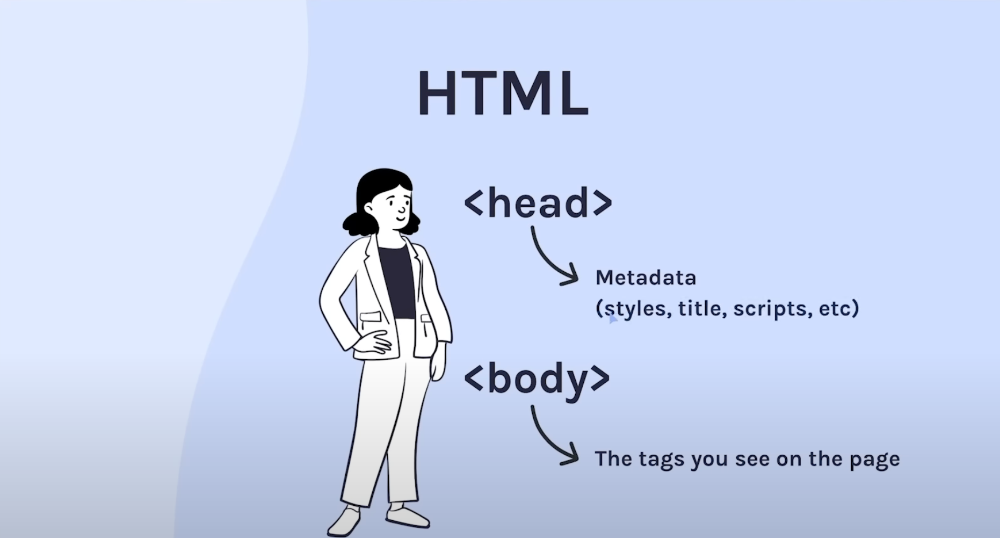

# Structure

HTML has it structure, like human.
It has it own head and body.

- `<!DOCTYPE html>`: tell the browser we are using HTML5 instead of HTML4
- `<html>`
- `<head>`: Metadata, for example: style, title, scripts, etc.
  - `<link>`: `<link rel="stylesheet" href="style.css>` -> integrate with CSS
  - `<title>`: `<title>Google.com</title>` -> the title shows on the tab
  - etc.
- `<body>`: The tags we used on the page and previous course (before 12_Structure)

