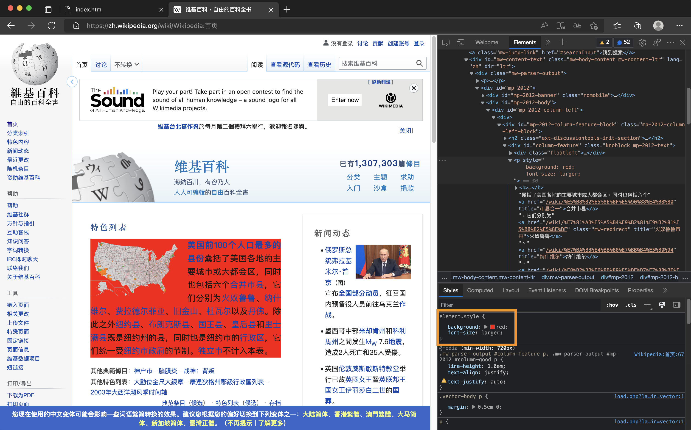

# Hack Wiki

You may change the css from the page all by your self.
You can click background, font-size, etc. whatever you want the browser.

However, if you refresh the page, all change will be gone as well, like the HTML course - <a href="../HTML_06_Website_Hacking">Youtube Hacking </a>

