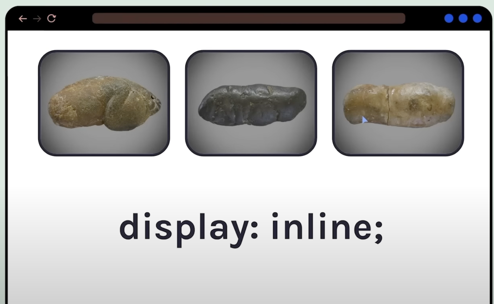
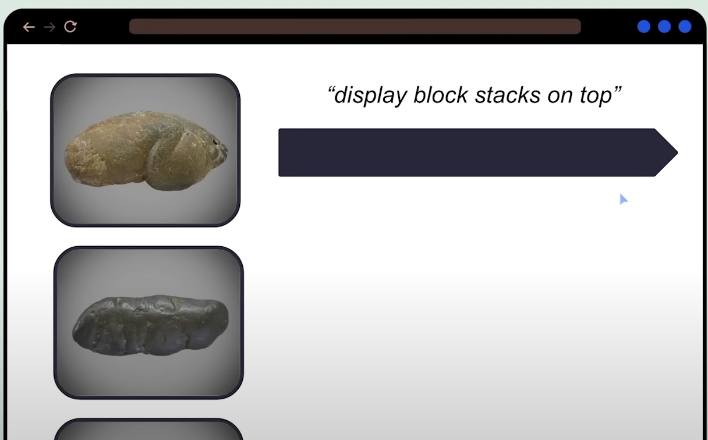

# Inline & Block Element

### Inline

> Images would stack up besides each other, like a line horizontally

```css
img {
  display: inline;
}
```



### Block

> Images would stack up on top of each other. Block level element blocks out the rest of horizontal space so that nothing else can be place there

```css
img {
  display: block;
}
```


