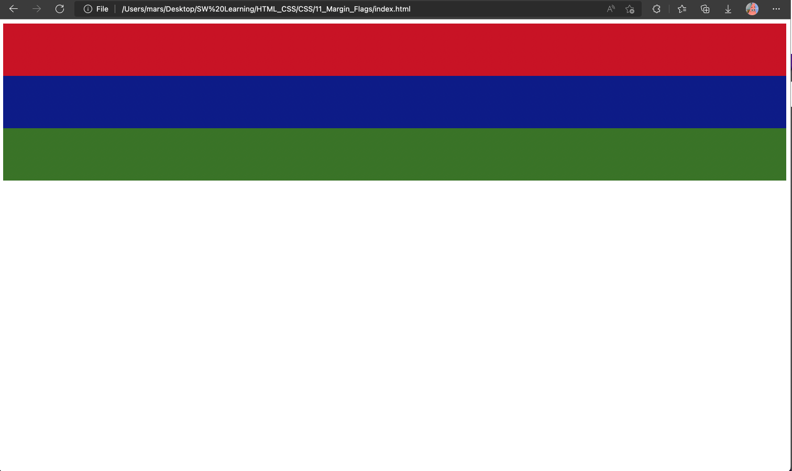
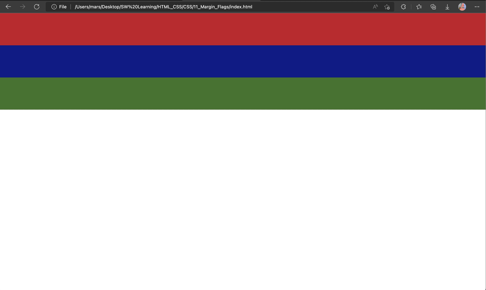

# Margin with Flags

> Margin is actually the space `around` an element

The browser defaults that we need space when creating body, as belows picture.

If you want to disable it, add a flag in `.css` file, and set the `margin: 0px` could be done.

