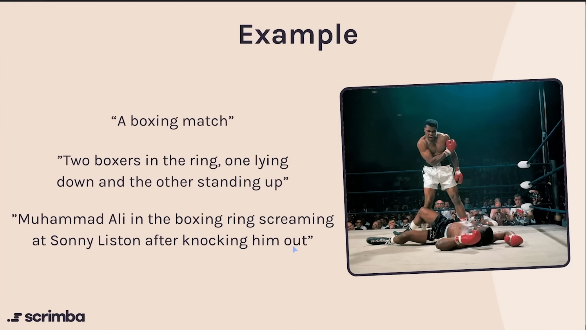

# Find File Path

- `alt`: describe the image so that the screen reader has something to read out loud. (for those who is the disabled and need accessbility tool like audio play, etc.)
- Why write `alt` texts?
  - Make your site accessible
  - Fallback if the image doesn't render properly
    ```html
    
    
    ```
    
  - Helps your site rank higher on Google
- writing good `alt` texts:
  - Don't include "image of"
  - Be concise (<125 characters)
  - Describe it "over the phone"
    
