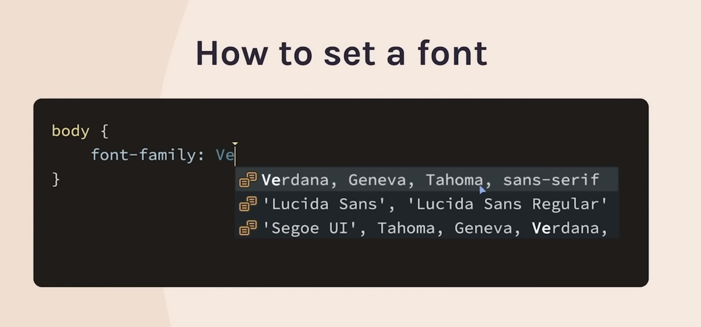

# Font

When you visit a website, for example: google.com. You visit the website via a client that could be your mobile, tablet, desktop, etc.
When you search www.google.com, it will send a request to Google server. Google Server then says "Okay! you want to visit our wbesite. Here is our HTML, CSS, JS, assets, font, etc. for your need to run in the browser", and send all these content back to the client.

However, some of websites won't sent the recipe for the font over the network.

- Because they will instead on their website use a font that most likely is pre-installed in the client.
- Also called "Web Safe Font"
  > The recipe rednering that font exists in most clients (servers don't send any font to users)

- How to set a font:

  - If the browser find the font pre-installed here, then it will use it.
  - However, if it can't find the font installed in the client's computer, then it find the next font style repectively in the value you type in.
  - `Serif`, and `Sans serif` are categories. (`san` means `without`)

    
